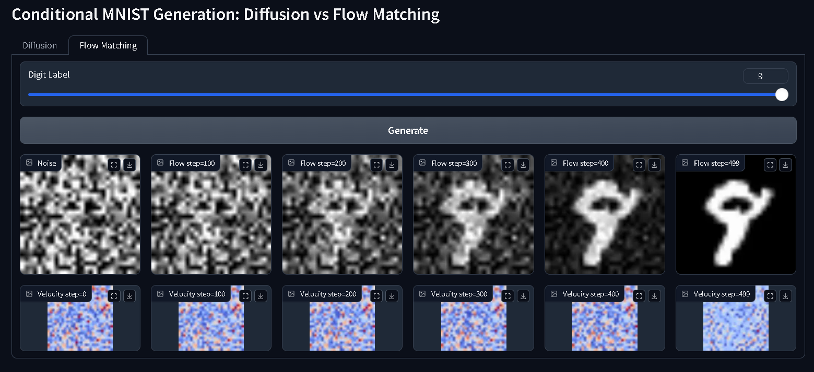

# 🧠 MNIST: Diffusion vs Flow Matching

<div align="center">
  
</div>

An interactive demo comparing **Diffusion Models** and **Flow Matching** for conditional image generation on MNIST. Understand their dynamics step by step — and visually explore the difference between denoising and velocity-guided synthesis.

---

## 🌍 Live Demo

▶️ [Try it on Hugging Face Spaces](https://huggingface.co/spaces/CristianLazoQuispe/mnist-diffusion-flow)

---

## 📦 Models

- [CristianLazoQuispe/MNIST_Diff_Flow_matching](https://huggingface.co/CristianLazoQuispe/MNIST_Diff_Flow_matching)

## 🧪 Code

- [GitHub Repository](https://github.com/CristianLazoQuispe/MNIST-diff-flow-matching)

---

## 🚀 Features

### 🌀 Diffusion

- Step-by-step denoising with noise prediction
- Visualize noise magnitude maps

### ⚡ Flow Matching

- Velocity-based direct generation
- Visualize velocity magnitudes with color maps

---

## 📁 Project Structure

```bash
.
├── codes/           # Jupyter notebooks & training scripts
├── demo/            # Gradio app
├── models/          # Pretrained weights (via Git LFS)
├── outputs/         # Generated samples
├── src/             # Model & training logic
├── data/            # MNIST dataset
└── README.md
